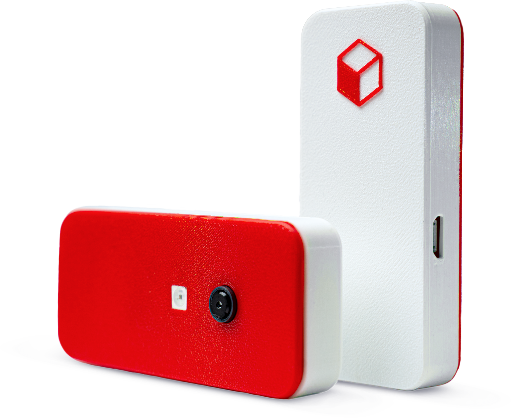

V posledním dubnovém týdnu spustila [Fragaria](https://fragaria.cz) řešení Karmen složené z cloudové služby a kontroleru Karmen Pill, který zajistí síťové připojení běžných FDM tiskáren. To bylo přitom dosud ve většině případů možné ovládat pouze přímo u tiskárny. O tom, že se 3D tiskaři nemohli podobného řešení dočkat, svědčí to, že první skladové zásoby zmizely během týdne.

_„Ještě před oficiálním spuštěním se hlásilo mnoho zájemců, kterým jsme umožnili předobjednávky přes náš [web](https://karmen.tech/en/). Předobjednavatelé vlastně vykoupili první vyrobený balík Karmen Pillů. Kvůli aktuální koronavirové situaci a tomu, že někteří naši dodavatelé měli odstavené provozy jsme se na čas ocitli bez skladových zásob. Toto manko se daří postupně snižovat a věříme, že budeme nejpozději do poloviny května schopni dodávat Pilly během jednotek dnů do celého světa. Karmen Pill je možné zakoupit buď na našem webu, nebo i v [katalogu mall.cz](https://www.mall.cz/prislusenstvi-3d-tisk/karmen-pill-karmen-pill-100020418042),“_{style=text-align:center} říká k tomu CEO Fragarie Martin Burián.

Karmen Pill je malá krabička s LED diodou na svícení při tisku v noci nebo v uzavřených prostorách. Připojením přes USB port zpřístupní tiskárnu do lokální sítě nebo internetu a umožní ovládání 3D tiskáren vzdáleně přes cloudovou službu Karmen; dosud bylo přitom u naprosté většině tiskáren možné nastavovat funkce pouze osobně a přímo na přístroji. Karmen Pill stojí 3.500 Kč bez DPH a v této ceně získá zákazník připravené řešení, které se automaticky aktualizuje a po základním nastavení jej lze jednoduše připojit k tiskárně, provést registraci do cloudové služby Karmen a tisknout. Karmen je kompatibilní s nejrozšířenějšími slicery včetně Slic3r, PrusaSlicer či Ultimaker Cura.

[Cloudová služba](https://next.karmen.tech) Karmen je otevřená pro registraci všech tiskáren, které mají standardní rozhraní a je možné je spravovat např. přes řešení [Octoprint](https://octoprint.org/). Správa tiskáren v aplikaci je nyní zdarma a kromě zařízení jednotlivců je možné hromadně spravovat i všechny tiskárny v rámci organizace. Každá škola, firma, coworková dílna, nebo jakákoliv jiná instituce si může své tiskárny připojit a následně je vzdáleně spravovat, monitorovat i zadávat tisky právě přes cloudovou službu Karmen. Plán vývoje počítá s mnoha rozšířeními, například evidencí spotřebovaného materiálu, tiskových hodin a dalšími funkcionalitami pro sledování nákladů na tisk, automatickou detekci chyb v tisku, inteligentní distribuci a plánování tisku apod.

Již nyní se hlásí mnoho testerů, kteří pomáhají zpřístupnit Karmen pro nejrůznější 3D tiskárny, kterých je opravdu hodně. Komunita 3D tiskařů a nadšenců pro open source technologie je pro Karmen velmi důležitá, a Fragaria už připravuje online službu pro sdílení know-how a uživatelských zkušeností, které přispějí k dalšímu rozvoji řešení Karmen. Celé řešení je z velké části open source a k dispozici je jak uživatelská, tak vývojářská [dokumentace](https://docs.karmen.tech), která se bude i díky nadšení 3D tiskařů po celém světě dále rozšiřovat.

_„Vnímáme, že mnoho šikovných domácích kutilů si vytvořilo své vlastní řešení na vzdálený monitoring 3D tisku. Protože se snažíme Karmen od začátku stavět jako otevřené řešení, velmi brzy bude možné registrovat do cloudové služby Karmen i 3D tiskárny, které buď konektivitu již v sobě mají, nebo se připojují přes nějaké obdobné domácí řešení, postavené např. na Octoprintu a Raspberry Pi,“_ říká produktový manažer Martin Bílek. _„Komunitu 3D tisku máme moc rádi a těšíme se, až se pustí do modelování a sdílení držáků na Karmen Pill. Ty nejsou součástí dodávky, ale každý si může vytisknout svůj vlastní držák v jakémkoliv tvaru. Velký prostor je i pro studenty škol, které Karmen používají.“_

Karmen bude v nejbližších měsících rozšířena o funkce pro monitoring, analýzy tisku, statistiky a inteligentní detekci chyb. V druhé polovině roku bude Karmen intenzivně spolupracovat se středními a vysokými školami, a podporovat je při zapojování 3D tisku do svých studijních plánů. Karmen je od začátku globální projekt a na zahraniční trhy oficiálně vstoupí během několika týdnů.
