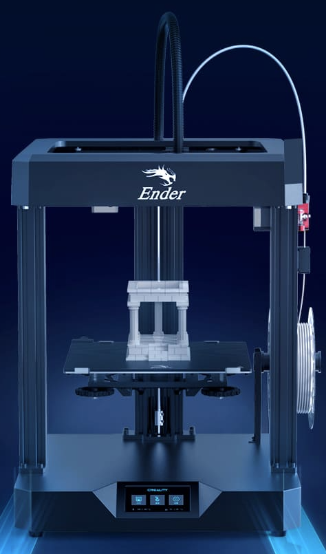
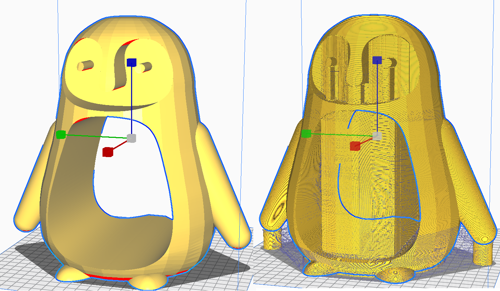

Těsně po napsání [předchozího článku o výhodách a nevýhodách tiskárny Creality Ender 6](../2021-04-13-ender-6/) vyšly informace o další novice od této čínské firmy. Na trh přivedla další tiskárnu s pořadovým číslem 7.

*Ender 7 zdroj: https://www.creality.com/goods-detail/creality-ender-7-3d-printer*

Ender 7 se v první řade chlubí novým designem a velmi vysokou rychlostí tisku až 250 mm/s. Tu je možné dosáhnout díky technologii Core XY, která je popsána v minulém článku o Ender 6 a v neposlední řadě díky Lineárnímu vedení v osách X a Y. O chlazení výtisku se stará dvojice radiálních ventilátorů 4010, což by mělo přinést o 69 % lepší chlazení než varianta s jedním ventilátorem. Tiskový prostor je 250 × 250 × 300 mm a cena stanovena na 699 dolarů, což je něco přes 16 000,-.

Otázkou zůstává, jestli tiskárna opět potvrdí tvrzení Creality a opravdu bude schopna tisknout rychlostí 250 mm/s. Pokud ano, znamenalo by to, že oproti standardním tiskárnám s rychlostí do 100 mm/s by byla 2x rychlejší, což je výrazná časová úleva hlavně u větších tisků. Hlavním vylepšením tiskárny oproti předchozí generaci je pohyb na lineárním vedení, které umožňuje tiskárně zvýšit rychlost při zachování přesnosti tisku. U těchto vysokých rychlostí ale nejde ani tak o maximální možnou rychlost, ale také o zrychlení. Standardně se používá zrychlení 500 mm/s2 a to si myslím, že pro tuto tiskárnu nebude žádné číslo. Pokud bychom chtěli použít tyto anebo podobné rychlosti i na menší modely, budeme muset jít do tisíců mm/s2, což právě lineární posuv přeci jen lépe umožní.

Pro představu jsem zapnul Slicer Cura (verze 4.10.0) a zajímalo mě, jakým způsobem se upraví časy tisku, při změně rychlostí. Pod ruku mi padl model tučňáka a jeho velikost jsem nastavil tak, aby se na něj včetně podpor spotřebovalo 997 g filamentu, což odpovídá jednomu standardnímu balení.

*Model tučňáka před a po vyslicování*

Profil jsem použil Standard Quality pro tiskárnu Ender 5, s výškou vrstvy 0,2 mm. Jedinou změnou je odebrání Build Plate Adhesion Plate a přidání podpor na default nastavení.

Cura výchozí rychlost tisku používá pouze na výplně. Ostatní rychlosti dělí dvěma. Já jsem se rozhodl zanechat výchozí rychlost i na tisk vnitřních stěn. Nastavené rychlosti pro jednotlivé tiskárny jsou v tabulce.

| Rychlosti (mm/s) | Ender 5 | Ender 6 | Ender 7 |
| ----------- | ----------- | ----------- | ----------- |
| Výplň | 80 | 150 | 250 |
| Venkovní stěna | 40 | 75 | 125 |
| Vnitřní stěna | 80 | 150 | 250 |
| Vršek/Spodek | 40 | 75 | 125 |
| Podpory | 40 | 75 | 125 |
| Přejezdy | 200 | 200 | 200 |
| První vrstva | 20 | 20 | 20 |

Přejezdy a rychlost první vrstvy jsem nechal stejné, přesto že je jasné, že Ender 7 bude schopna přejezdů 250 mm/s. Zrychlení jsem nechal také na původní hodnotě 500 mm/s2

| | Ender 5 | Ender 6 | Ender 7 |
| ----------- | ----------- | ----------- | ----------- |
| Doba tisku | 71 h a 45 min | 59 h a 5 min | 49 h a 0 min |

Z časů, které Cura spočítala je patrné, že doba tisku takovéhoto velkého modelu se bude na jednotlivých tiskárnách velmi lišit. Podle mých propočtů je Tiskárna Ender 6 s takovýmto nastavením o 18,7 % rychlejší než Ender 5. Ender 7 je dokonce o 32,7 % rychlejší než Ender 5. V porovnání tiskáren Ender 7 a Ender 6 je tu zrychlení tisku o 17,2 %, což znamená, že je to podobný mezigenerační skok úspory času, jako mezi Ender 5 a Ender 6.

Co se týče přesnosti tohoto výpočtu, musí být brán s velkou rezervou. Přestože Cura čas tisku s mojí Ender 6 odhaduje velmi přesně, kolikrát i na minutu, tak je zde několik neznámých.
V první řadě se Cuře nelíbí rychlosti tisku nad 150 mm/s a podbarvuje je oranžově. Nevím jak na to reaguje samotným výpočtem doby tisku, ale přesnost se tím může lišit.
Další důležitá věc je výše zmíněné zrychlení. Ani jsem se nepokoušel ho do výpočtu zahrnout, protože s ním Slicery neumí moc pracovat a je to vlastně i logické. Zkoušel jsem změnit zrychlení u Ender 7 z 500 mm/s2 na 2000 mm/s2 a rozdíl byl asi 18 minut. Osobně si myslím, že to reálně bude více, protože když jsem zkoušel měnit zrychlení na mé Ender 6, bylo to znát více i okem a to jsem se pohyboval v rychlostech okolo 120 mm/s.

Závěrem bych chtěl říci, že mě posun v deklarovaných rychlostech u nového modelu Ender 7 nepřekvapil, ale spíše se mi líbí, jakým směrem se 3D tiskárny vyvíjí. Je vidět, že výrobci se soustředí na to, co zákazníci následně se svými tiskárnami dělají a snaží se je těmto požadavkům přizpůsobit. Konkrétně mám na mysli lepší ofuk výtisku a lineární vedení. Osobně se mi i přes toto všechno více líbí Ender 6, ale lineární vedení by se s kombinací Core XY velmi hodilo. Ender 7 má určitě i jisté nedostatky a tou je třeba mohutná kontrukce v horní části tiskárny, která zabraňuje přístupu k tiskové podložce a další. V první řadě ale doufám, že se Creality poučilo u předchozí Ender 6 a firmware na Ender 7 bude o poznání lepší.

__Lukáš Žídek__
