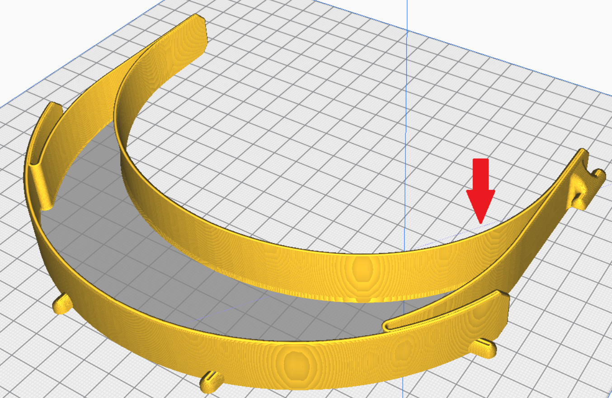
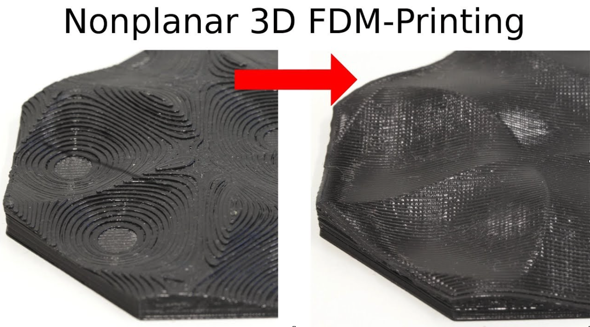
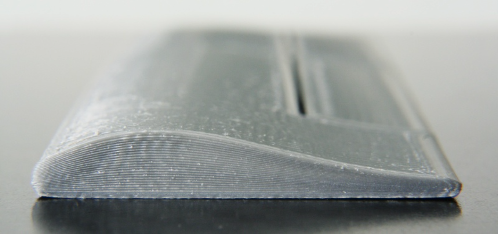

Asi nejsem jediný, kdo se zamyslel nad tím, jestli je všude přítomný 3D tisk opravdu 3D. Když se totiž zamyslíme nad funkcí klasických FMD tiskáren, tak vám asi dojde, že se nejedná o plnohodnotný tisk ve třech osách. Co tím myslím? Jednoduše řečeno osy X a Y se standardně umí pohybovat současně, konají tedy 2D pohyb a tím vytváří jednotlivé vrstvy. Osa Z se standardně pohne až tehdy, kdy je celá vrstva hotová a může se tisknout vrstva další. Z toho vyplývá, že se zároveň nepohybují všechny osy najednou, respektive pohybovat najednou se můžou, ale během tohoto pohybu se netiskne. Navíc jsme omezeni v ose Z pouze na pohyb v jednom směru.

Někdo může namítnout, že když použije funkci Z-hop že se během tisku jedné vrstvy pohybuje i osa Z.  To je sice pravda, ale při povyskočení osy Z nahoru a následném sjetí zase dolů nedochází k tisku, ale naopak se používá, když tiskař nechce mít na povrchu tisku vidět vady od filamentu. (Jak funguje Z-hop? Představme si, že tiskárna dotiskne jednu část výtisku a chce přejet na další část. Tisková hlava vyjede kousek nahoru, aby se přebytečný natlakovaný filament z trysky vytlačil směrem nahoru za pohybem trysky a ne do stran při přejezdu. Tím se částečně předejde nehezkému povrchu v místech přejezdů, ale o něco to zpomaluje tisk a může mít vliv na následující vrstvu v místech, kde se Z-hop vykonal na vrstvě předešlé).

Další speciální funkcí, která se dle mého nejvíce blíží opravdovému 3D tisku je Vase mode. Tento mód funguje tak, že se celý výtisk, až na spodní vrstvy, ty se můžou tisknout standardně, tiskne jako „jedna“ vrstva. Jak je to možné? Pokud si představíme tisk dutého válce, který bude mít tloušťku stěny stejnou jako je šířka extruze tisku, můžeme ho tisknout jednoduše jedním objetím daného obvodu. Principem Vase modu je plynulé navázání jednotlivých vrstev. Jinak řečeno, tisková hlava se posouvá v ose Z tak, že po dotisknutí jedné vrstvy je ve výšce začátku vrstvy následující. K posunu v ose Z tedy dochází plynule během tisku v rovině XY. Celý tisk je tedy tvořen lidově řečeno jednou špagetou, která na sebe plynule navazuje. Takto vytisknutý válec, nebo obecně objekt, nebude mít šev, což je velkou výhodou. Další výhodou je rychlejší tisk, protože nedochází ke zpomalování a zrychlování tiskové hlavy při změně vrstev a nepotřebujeme používat žádné retrakce. Na to je navázána další výhoda a tou je zachování konstantního průtoku materiálu a tím snadná regulace teploty tisku, což je pro některé materiály velmi důležité. Velkou nevýhodou je ale omezené použití. Je zřejmé, že takovýmto způsobem se dají tisknout jen určité typy modelů. Při návrhu 3D modelu stojí za úvahu, zda by nešel udělat tak, aby bylo možné ho na Vase mode tisknout.

Na začátku Covid pandemie se 3D tiskařská komunita sjednotila a začala ve velkém tisknout čelenky na štíty pro zdravotníky, do které se zapojily i nějaké firmy. Podobný 3D model čelenky, kterou rozšířil Prusa Research upravil někdo v komunitě tak, že se dala tisknout právě na Vase mode, což výrazně zjednodušilo a urychlilo tisk. Jedná se relativně o složitý tvar, ale úpravou modelu to bylo možné. Pro zajištění pevnosti u štítu bylo zapotřebí tisknout model extruzí 1 mm a ideálně mít zvýšený Flow na 120 %. Když se čelenka vytiskla správně, fungovala výborně, ale bohužel hodně lidí se hnalo za časem a kvalita nebyla vůbec dobrá. Tyto čelenky se pak bohužel nedaly použít, protože nebyly dostatečně pevné. Na Obrázku 1 je vidět vyslicovaná čelenka na Vase mode v softwaru Cura. V náhledu je zapnuta viditelnost přejezdů, ale na celém tisku je pouze jeden, a to ten na první vrstvu. Mě to tehdy hodně zaujalo, a proto se o Vase mode hodně zajímám a používám ho co nejvíc.

*Obrázek 1 - Uzpůsobená čelenka na tisk na Vasemode - Cura*

Tím jsou asi možnosti klasického FMD tisku vyčerpány. Jsou tu ale jisté experimentální metody, které posouvají FMD 3D tisk ještě dál. Konkrétně mám na mysli Nonplanar tisk. Výše jsme si vysvětlili, že během standardního tisku se jedna vrstva tiskne v jedné rovině (Planar tisk). Z toho vyplývá, že nerovinný (Nonplanar) tisk se nedrží v jedné rovině, ale využívá omezeně celý 3D prostor. Tisk funguje tak, že během tisku jedné vrstvy dokáže tiskárna hýbat osou Z při zachování pohybu v osách X a Y.  Pokud bychom tedy chtěli tisknout kopec ve tvaru hory Říp, můžeme klasickým Planar tiskem vytisknout základní tvar a poté tento tvar „potisknout“ pár TOP vrstvami Nonplanar tiskem, který by překryl nedokonalosti standardního tisku. Na Obrázku 2 je vidět vlevo klasický planar tisk a vpravo nonplanar tisk. Dalším využitím je tisk složitějších tvarů, jako jsou různé vrtule, lodní šrouby, křídla letadel a podobně.

*Obrázek 2 – Klasický/Nonplanar tisk zdroj: https://www.youtube.com/watch?v=km1lvuva5mI*

Na internetu najdete mnoho videí i článků, ve kterých jsou vidět výsledky a i porovnání výtisků obou metod. Na Obrázku 3 je boční pohled na křídlo letadla, které bylo tisknuto právě Nonplanar metodou.

*Obrázek 3 - Příklad Nonplanetárního tisku Zdroj: https://hackaday.com/2016/07/27/3d-printering-non-planar-layer-fdm/*

Zajímavé je, že takového tisku je možné docílit i bez větších fyzických úprav na tiskárně, ale to má za následek jistá omezení. V první řadě se musí přizpůsobit software a to jak ze strany firmwaru tiskárny, tak sliceru. V druhé řadě je tu omezení na straně tiskové hlavy. Na obrázku 4 je vidět problematika, která u Nonplanar tisku nastává. V levé části obrázku vidíme standardní Planar tisk, který všichni dobře známe. Prostřední a pravá část obrázku ukazuje různé úhly, pod kterými mohou, respektive nemohou klasické trysky tisknout. Za předpokladu, že nebudeme na tiskárně upravovat tiskovou hlavu ani trysku, je možné dosáhnout nižších úhlů, než když se použije nějaké vhodnější řešení jako jsou delší trysky apod.

*Obrázek 4 - omezení úhlu tisku zdroj: https://hackaday.com/2016/07/27/3d-printering-non-planar-layer-fdm/*

Další možností je pustit se do úpravy tiskové hlavy. Pokud by se jí přidaly další dva stupně volnosti, dokázala by se naklánět ve dvou osách a tím pádem by bylo možné tisknout pod větším úhlem, ale to už bychom mohli pojmenovat spíše 5D tisk (Popř. 3+2D tisk). Takovýmto tiskem bychom ale určitě narazili na spoustu problémů v různých oblastech a je velkou otázkou, jestli je něco takového vůbec potřeba.

Abych si nakonec odpověděl na svou otázku ze začátku článku, jsou 3D tiskárny opravdu 3D? Je jasné, že jsou, a to hlavně díky tomu, že vytvoří 3D objekt přesně podle naší předlohy. Standardně jsme ale omezeni na růst výtisku v jednom směru osy Z a často nám to taky stačí. Tam kde nám to nestačí, jednoduše použijeme podporu anebo výtisk rozdělíme na více částí.

Osobně si ale myslím, že nás čeká budoucnost víceosých strojů, které budou moci pomocí různých robotických ramen zajišťovat i plnohodnotný tříosý nebo víceosý pohyb. Otázkou ale je, jestli se pro ně najde dostatečné uplatnění.

Koneckonců jestli potřebujete víceosou 3D tiskárnu, kupte si 3D pero… 😊

__Lukáš Žídek__
