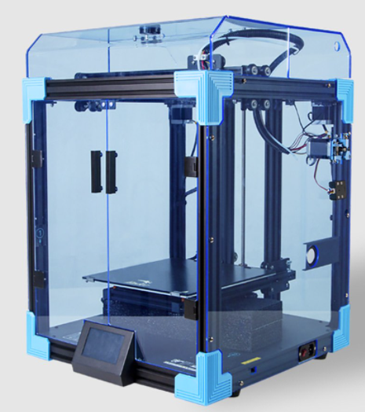
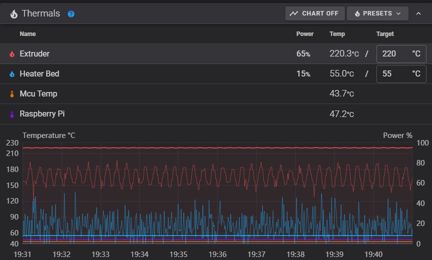
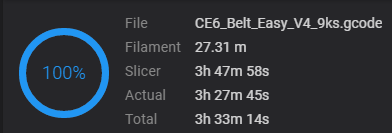
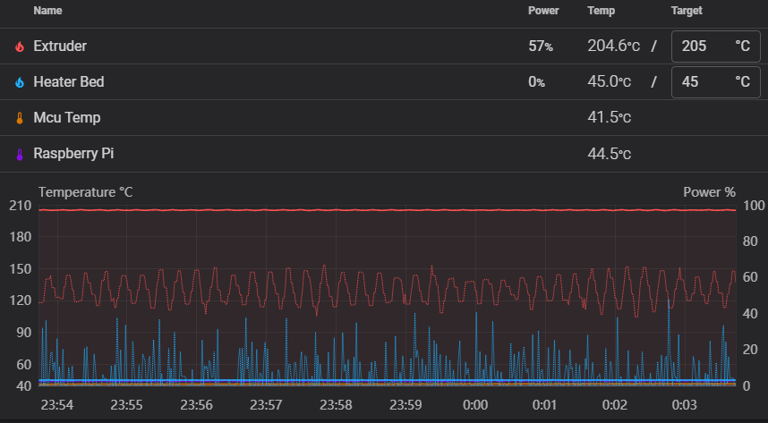

Jelikož se mi koncem listopadu v Black Friday akci podařilo zakoupit horní kryt na moji tiskárnu Creality Ender 6, svitla mi v hlavě myšlenka, jestli se takový kryt někdy zaplatí na ušetřeném proudu, díky menšímu úniku tepla z tiskárny.

*Obrázek 1 - Ender 6 s horním krytem (https://www.creality3dofficial.com)*

Kryt mi přišel po vánočních svátcích a zrovna jsem měl naplánované nějaké delší opakované tisky, tak jsem si řekl, že je to ideální příležitost na opakované měření. Předmětem se stal tisk, který trval něco přes 3,5 hodiny, jako je vidět na obrázku, během kterého se tisklo 9 stejných objektů jeden za druhým. To znamená, že ve sliceru Cura byl nastaven parametr „Print sequence“ na „One at the time“. Kdo toto nastavení nezná, tak to zjednodušeně funguje tak, že tiskárna netiskne první vrstvu u všech tisknutých objektů najednou a pak nepokračuje na druhou, ale že vytiskne celý jeden objekt a pak tiskne objekt další.

*Obrázek 2 - Délka tisku 3h 33m 14s*

Jelikož byla obě měření prováděna při tisku stejného gcode, za pokojové teploty (24 °C) a tiskárna byla v obou případech vychladlá, dovolím si okolní vlivy na přesnost měření zanedbat. Během tisku se kolem tiskárny nechodilo, ani se v místnosti nevětralo. Jako nejdůležitější parametry tisku vidím teplotu trysky nastavenou na 220 °C a teplotu bedu 55 °C. Standardně tisknu na menší teplotu trysky, ale jelikož jsem tiskl extruzi 0,5 mm, výšku vrstvy 0,25 mm a rychlosti 100/60 mm/s, je teplota trošku zvýšená, aby docházelo k lepšímu prohřátí materiálu, přesto že se jednalo o klasické PLA.

K měření jsem použil Wattmetr do zásuvky EXTOL LIGHT, který dokáže měřit i celkovou spotřebu energie za určitý čas. Zároveň jsem samotný tisk sledoval přes prostředí Fluidd, který používám na ovládání tiskárny s firmwarem Klipper přes mikropočítač Raspberry Pi. Ve Fluidd je možné zobrazit grafy, které ukazují aktuální procento výkonu ohřívání trysky i podložky. Už v samotných grafech je vidět velký rozdíl mezi tiskem s a bez krytu.

Jelikož se standardně používají tiskárny otevřené, budu vycházet z toho, že hodnoty naměřené bez krytu jsou výchozí a výsledky naměřené s krytem budu brát jako úsporu.

Na obrázcích je vidět výřez grafů během jednotlivých tisků. Červené křivky přísluší hodnotám trysky a modré křivky bedu. Tlustou čarou jsou vyobrazeny měřené teploty (stupnice vlevo). Tenčími čarami jsou zobrazeny jednotlivé křivky aktuálního výkonu trysky a bedu v čase (stupnice vpravo). Aktuální hodnoty, včetně požadovaných, jsou také vidět nahoře v tabulce.

*Obrázek 3 - Graf během tisku bez krytu*

Z grafu je tedy odhadem vidět, že výkon trysky se během tisku pohyboval mezi 60 % až 85 %. U bedu je rozsah výkonu od 0 % do 40 %. Po dokončení tisku se na wattmetru objevila hodnota 473 Wh spotřebované elektrické energie.

*Obrázek 4 - Graf během tisku s krytem*

Na druhém obrázku je vidět graf během tisku s krytem. Už pouhým okem je vidět značný rozdíl. Obě křivky mají jednoznačně užší rozsah, ve kterém se výkon pohybuje, a jsou položeny níž. U trysky je to odhadem od 50 % do 80 % a u bedu od 0 % do 35 %. V obou případech jsou v grafu ojediněle i vyšší špičky, ale ty jsem pro zjednodušení zanedbal. Celkově jsem ale už během tisku věděl, že naměřím nějaký rozdíl ve spotřebě, protože se mi graf s krytem líbil mnohem více. Po dokončení druhého tisku (s krytem) jsem si zapsal opět spotřebovanou energii a pomyslná ručička se zastavila na hodnotě 383 Wh.

Obě hodnoty jsem si dal do excelu a začal počítat úsporu. Když vypočítám procentuální pokles spotřebované energie bez krytu oproti tisku s krytem, vychází mi číslo 19,03 %, což můžu zaokrouhlit na rovných 19 %. V absolutních číslech vychází rozdíl mezi tisky na rovných 90 Wh. Pokud k hodnotám naměřeným přidám složku aktuální ceny elektřiny, která se v pražském bytě pro zjednodušení blíží k 6 Kč/kWh, můžeme snadno dopočítat, že během tisku s krytem došlo k úspoře 0,54 Kč. 54 haléřů je docela pěkné číslo, které se dá dobře vydělit 9ks výrobků, které jsem tisknul a z tohoto výpočtu vychází, že jsem na jednom výrobku ušetřil 6 haléřů jen zakrytováním.

Teď abych se vrátil k mé původní otázce, jestli se kryt vůbec někdy zaplatí. Kryt jsem koupil za přívětivých 1280 Kč. Jelikož jsem objednával ještě nějaké další věci, neplatil jsem žádnou další dopravu. Pokud přepočítám námi ušetřené peníze na jednu minutu tisku, vychází mi úspora 0,00254 Kč za minutu. Pokud tedy vydělím pořizovací cenu touto úsporou, vychází mi zaokrouhleně číslo 503937. Přesně tolik minut tisku bude trvat, než se mi pořízení takového krytu zaplatí ušetřenou energií. Pro představu je to 8398 hodin a to je 349 dní, takže necelý rok. Z toho vyplývá, že je to číslo, které se může někomu povést na tiskárně opravu natisknout. Pokud budu mít tiskárnu 2 roky a pojede přibližně polovinu tohoto času, což je reálné, bude kryt zaplacený jen na úspoře elektrické energie, což mi nepřijde jako špatný výsledek.

Když se nad tím reálně zamyslím, je jasné, že u takového kratšího tisku zabere procentuálně delší čas nahřívání tiskárny ze studeného stavu, než kdybych podobné měření prováděl na celodenním tisku. Tím může být měření trošku zkresleno, ale tak to je realita. Na druhou stranu Ender 6 má už od výrobce boční zakrytování, takže se dá počítat s určitou úsporou energie i na něm, tedy i bez vrchního krytu. Jinak řečeno u tiskárny, jako je Ender 3, která je úplně otevřená, bude kompletní zakrytování ještě výrazně větší úsporou. Další věcí může být pořizovací cena krytu. Já ho kupoval za velmi výhodnou cenu, aktuálně se na stejném e-shopu prodává za 1753 Kč, což je zhruba o čtvrtinu více, a to je ještě pořád dobrá cena v porovnání s cenami v jiných obchodech.

Většinu rozsahu článku jsem věnoval tomuto experimentu, ale závěrem bych chtěl napsat ještě pár věcí k samotnému krytu. Primární účel krytu, minimálně pro mě, není úspora energie během tisku. Všeobecně nejdůležitějším přínosem je zvýšení kvality tisku hlavně některých materiálů (ABS/ASA atd.). Další výhody tohoto krytu jsou ve snížení hlučnosti tiskárny a snížení šíření zápachu během tisku. Toto jsou dva hlavní důvody, které mě přesvědčily si kryt pořídit. Osobně na tiskárně využívám její maximální tiskovou výšku 40 cm a musím uznat, že kvalita tisku ve výškách 30+ cm se výrazně zlepšila, což jsem v takové míře nečekal (i z PLA). Další výhodou je, že od doby, co mám kryt, tisknu na teplotu podložky jen 45 °C, místo 55 °C, a zatím mi všechny výtisky z PLA držely bez jediného problému. Tím pádem se mi kryt vyplatí více i finančně. Teplota v tiskárně se pohybuje okolo 30-35 °C podle délky tisku. Pro představu přikládám obrázek grafu během tisku s podložkou ohřátou na teplotu 45 °C s krytem. Zde je vidět ještě velký posun v úspoře energie za vytápění bedu, který jsem ale neměřil.

*Průběh tisku s podložkou ohřátou na teplotu 45 °C s krytem*

Kryt má ale i nějaké nedostatky. Největší problém krytu je asi to, že není nijak přichycen k tiskárně, takže se občas stane, že přizvednu celý kryt, a to není nic příjemného, hlavně během tisku. Dále se občas bowden tiskárny zadrhává o hlavy šroubů, které drží obě poloviny krytu pohromadě. Asi největší problém se ale objevil při tisku na vyšší teplotu podložky, právě okolo 55 °C, při které občas dochází k ucpání bowdenu. Celý problém je pravděpodobně zapříčiněný tím, že jsem na hot endu vyměnil ventilátor za tišší a s nižším průtokem vzduchu (cca 7 m3/h). Díky zvýšené okolní teplotě okolo 35 °C už nestíhá tento ventilátor dostatečně chladit. Po dokončení tisku a vychladnutí tiskárny filament v bowdenu ztuhne a tím se bowden ucpe, někdy se tak stane i během tisku. Budu tedy nucen pořídit nový ventilátor s větším průtokem, podobným tomu originálnímu, ale s magnetickými ložisky kvůli hlučnosti.

Na závěr bych chtěl říci, že mě kryt tiskárny svými vlastnostmi velmi mile překvapil, a i přes jeho nedostatky to byla velmi dobrá koupě. Úspora peněz během tisku s ním už je jen taková na první pohled neviditelná výhoda, která ale určitě stojí za zmínku.

__Lukáš Žídek__
