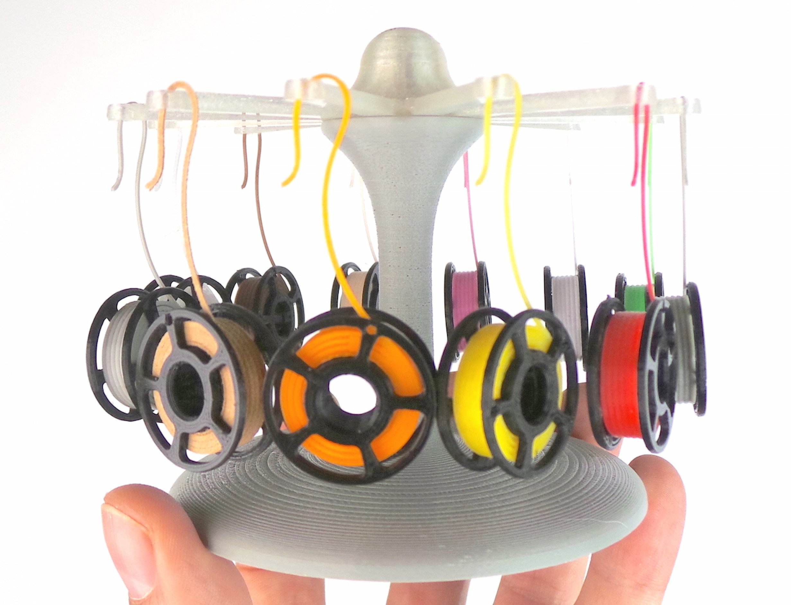

*Ilustrační obrázek. Zdroj: (https://flickr.com/photos/creative_tools/)*

**Multimateriál u Průšů** - přes Karmen Pill, ale i Octoprint můžete nyní snadno změnit materiál v průběhu tisku. Jak na to se dozvíte [zde](https://docs.karmen.tech/#/konfigurace-pill-podpora-mmu).

Vylepšili jsme **nastavení kamery**. Pro uživatele s vlastním řešením Octoprint bez kamery, je možné obraz v rozhraní vypnout. Všichni ostatní mohou **obraz nově i otáčet**.

Udělali jsme pořádek v gcodech. Nyní lze **gcody třídit do složek** podobně jako funguje adresářová struktura.

**Posíláme už jen přes Zásilkovn**u a to i na konkrétní adresu, nejen do výdejního místa.

I letos se na Vás budeme těšit na **[Maker Faire v Praze](http://makerfaire.cz/prague/)**, kde budeme mít stánek.

Zajímá Vás, **které 3D tiskárny jsou kompatibilní s** [Karmen Pill](https://karmen.tech/cs/produkty/karmen-pill/)? Námi prověřené značky jsou tyto, ale Pill bude fungovat na jakékoliv tiskárně kompatibnílní s Octoprintem, což je naprostá většina běžně dostupných tiskáren na trhu:

- Creality ENDER 3 - 7
- tiskárny Prusa Research
- Artillery Genius
- Anet A8
- KRYAL Cube
- FLSUN Speed Racer
- Snapmaker A350

Máte **vlastní řešení** postavené na Octoprintu? **Připojte si jej do
cloudové služby** [Karmen](https://karmen.tech/cs/produkty/karmen-cloud/) a využívejte všechny funkce **zdarma**. Návod jsme pro vás připravili [zde](https://docs.karmen.tech/#/pripojeni-octoprintu-do-karmen-cloudu).

