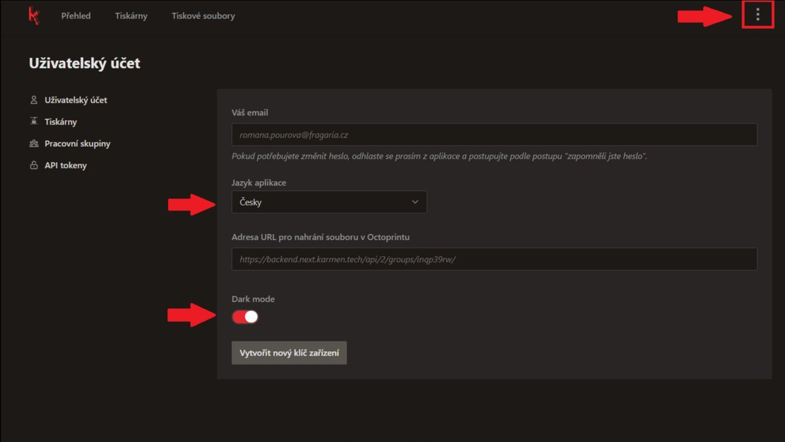
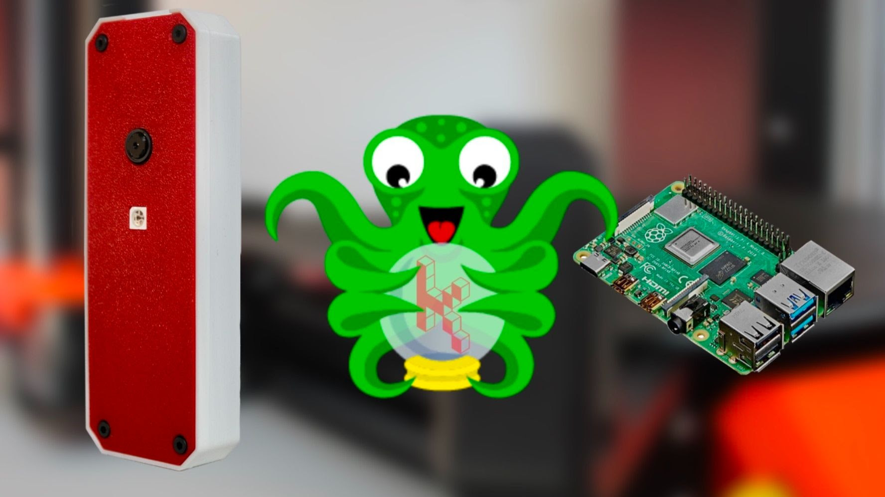

Ani v dubnu jsme nezaháleli a máme pro Vás několik novinek v řešení na vzdálenou správu 3D tiskáren Karmen.

- **Aplikace je** vedle angličtiny nově **i v češtině**! Není bez zajímavosti, že překlad si u nás vzal na starosti slovenský kolega ;-).
- **Přidali jsme** i možnost přepínání zobrazení v **dark mode**. Když sledujete tisky delší dobu, nebudou Vás bolet oči.
- **Karmen** můžete spouštět **jako klasickou mobilní** nebo **desktopovou aplikaci** přes ikonku ... pro znalce "PWA". 
- Víme, že Karmen Pill umisťujete na tiskárny různě. Proto jsme přidali možnost **natočení obrazu z kamery**. Když tedy připojíte Pill jinam než na desku, neukroutíte si hlavou.
- **Maker Faire v Praze** nebude v červnu, ale až v září a my tam samozřejmě budeme.

Ještě jednou bychom chtěli upozornit na nový a výrazně zjedodušený [postup připojení vlastních řešení](https://docs.karmen.tech/#/pripojeni-octoprintu-do-karmen-cloudu) nad Octoprintem. Cloudová služba [Karmen](https://next.karmen.tech/) je zdarma a přináší řadu výhod:

- Zabezpečený přístup do domácí odkudkoliv (hackeři mají nyní sezónu).
- Nepovedený tisk mohu odkukoliv přerušit (šetříme materiál i čas).
- Gcody jsou v cloudu a lze je odkudkoliv stáhnout a pustit tisk (je to bezpečné, buďte si jisti).
- Workspace lze lehce sdílet s dalšími uživateli (tiskne back office i celá rodina).
- Pokud máte více 3D tiskáren na více místech, můžete je vidět v jednom rozhraní, ale i rozdělit do několika účtů.
 

