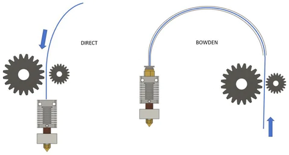

Už před nějakou dobou jsem se rozhodl, že svojí Creality Ender 6 předělám na tiskárnu s přímým extruderem. Pro nováčky, extruder je zjednodušeně řečeno podavač materiálu do tiskové hlavy. Jelikož mám s přestavbou nějaké zkušenosti z předešlé Creality Ender 3, věděl jsem do čeho jdu. Možností je dnes ale o dost více, než tomu bylo před cca 2-3 lety.

V první řadě bych chtěl vysvětlit, co to vlastně Direct, česky řečeno přímý extruder je a jaké jsou zásadní rozdíly mezi „klasickým“ bowdenovým řešením. Pro neznalé bowden je teflonová hadička, kterou je veden filament.

Většina levnějších tiskáren je osazena extruderem, který je napevno přišroubovaný ke konstrukci tiskárny a do tiskové hlavy podává filament skrz dlouhý bowden. Přímý extruder je ale připevněn přímo na tiskové hlavě, což má své výhody i nevýhody.

*Direct a Bowden extruder (zdroj: https://thinkspace.pl/en/which-extruder-should-you-choose-bowden-vs-direct)*

Hlavní výhodou přímého extruderu je, že vzdálenost mezi podávacími kolečky a tryskou je snížená na minimum. Díky tomu má extruder výrazně lepší kontrolu nad materiálem v tiskové hlavě a tedy i v samotné trysce. Díky tomu je také možné výrazně zkrátit retrakce, což člověk pozná na výsledné době tisku. Další výhodou u většiny přímých extruderů je možnost tisknout více druhů materiálů, jako jsou třeba flexi (měkké) materiály. Někdy se udává jako výhoda i možnost použití menšího a tedy levnějšího motoru, který má zároveň i menší spotřebu. Tyto dva argumenty jsou podle mého názoru hodně sporné, protože kdybych extruder na přímý nepřidělával, nemusím kupovat nový „levnější“ motor vůbec. Z toho vyplývá, že to platí pouze u tiskáren, které jsou přímým extruderem vybaveny už z výroby anebo na tiskárně starý motor odejde do věčných lovišť. Co se týče nižší spotřeby menšího motoru, tu si myslím spotřebují motory na pohyb v osách X a Y z důvodu větší hmotnosti tiskové hlavy.

Vše má své pro a proti a přímý extruder toho není výjimkou. Jako hlavní nevýhodu bych viděl již zmíněné výrazné zvýšení hmotnosti tiskové hlavy, což je velmi důležitý parametr hlavně u vyšších rychlostí. Negativní důsledek tak může být snížená kvalita tisku, ale i to se dá částečně kompenzovat. O tom si můžeme říci něco příště. Kvůli vyšší hmotnosti tiskové hlavy je zvýšená zátěž motorů na pohyb tiskárny v osách X a Y, což může vést k jejich přehřívání, hlavně při zakrytování tiskárny, a tím i snížení jejich živostnosti.

Proč jsem se já rozhodl přejít na Direct? Mě osobně k tomu vedlo to, že Ender 6 má díky své velké tiskové ploše a umístění původního extruderu velmi dlouhý bowden. Původní délka byla okolo 1 metru. Já jsem po koupi tiskárny přesunul extruder blíže k podložce a tím se bowden zkrátil na cca 50 cm. I přes to jsem se nedostal pod 6cm retrakce při rychlosti okolo 30-35 mm/s. Pokud jsem chtěl mít výtisk opravdu pohledově pěkný i v místech retrakce, musel jsem jít na 8 mm a to už je opravdu hodně. Přímé extrudery mívají retrakce zpravidla pod 1 mm, spíše okolo 0,5 mm, což je zásadní rozdíl.

Když jsem se rozhodoval, jaký extruder pořídím, měl jsem v hlavě pár řešení. Do úzkého výběru se dostaly extrudery od firem BondTech LGX Lite, BIQU H2 a E3D Hemera. Poslední dva zmíněné jsou all in one řešení, jinak řečeno obsahují v balení extruder s motorem, heatblok, heatbrake i heatsink. LGX Lite je spíše takovou skládačkou, kde se dá koupit pouze samotný extruder bez motoru, tak i s motorem. Uživatel si může vybrat z řady kompatibilních hotendů (lze dokoupit různé adaptéry) anebo si celý systém vymyslet a poskládat úplně sám.

Touto cestou se vydal můj dobrý 3D tiskařský kamarád Jiří Loveček, kterého znám z naší FB skupiny na Ender 6. Skombinoval LGX Lite s Trianglelab dragon hotendem a osadil to na držák Hero Me šesté generace. Touto kombinací dá se říct zachoval tiskovou plochu 260x260 mm. Aktuálně navrhuje nový držák, který je založený na držáku Klemco a tím by mohl tiskovou plochu odhadem zvýšit na 265x265 mm. Jelikož je pro mě tisková plocha jeden z nejzásadnějších parametrů, zjišťoval jsem si, jak je na tom BIQU. Po výběru nejvhodnějšího držáku mi vyšly podobné hodnoty, což mi dostačovalo. Bohužel Hemera v tomto ohledu zaostává, jelikož je sama o sobě výrazně větší než BIQU. Dalším důvodem, proč jsem si vybral BIQU H2 byla cena, jelikož je to nejlevnější řešení (cca 2 000 Kč) z výše uvedených a pro moje účely dostačuje.

Pro představu přidávám fotku modelu držáku na základu Klemco, kterou mi Jirka poslal včetně rozměrů. Šířka extruderu i se všemi osazenými periferiemi je 101,3 mm. Hloubka je pak necelých 63 mm, ale bez mezi desky, která bude mít cca 5 mm. Celkový rozměr bude tedy cca 101,3x68 mm. Pro porovnání můj BIQU měří přesně 86x62 mm. Díky tomu jsem byl schopen navýšit tiskovou plochu na krásných 270x272 mm (Osa X a Y). Bystré oko si ale určitě všimne, že na držáku od Jirky jsou dva Blowery 5015, ale na mém BIQU pouze jeden. Z toho je jasné, že bude Jirkovo řešení o něco větší, ale také bude mít větší chladící výkon.

*LGX Lite na custom držáku Klemco*

Na samotnou přestavbu to chtělo dobrou přípravu, protože nejhorší, co se člověku může stát je, že po rozebrání celé tiskárny zjistí, že mu chybí vytisknout nějaký díl, což se mi samozřejmě stalo… Naštěstí se jednalo pouze o zadní držák vodícího řetězu, někdy také nazývaného jako kabelový ukladač. Bez něj se to dalo přežít a alespoň jsem měl testovací objekt na seřízení tiskárny po jejím upgradu.

*Částečně osazeno*

Když jsem měl prodloužené všechny kabely se správnými konektory, osadil jsem držák extruderu a samotný extruder, jako je vidět na obrázku. Následovalo osazení ventilátoru na ofuk výtisku a nakonec i BlTouch. Celkem jsem potřeboval jen hromadu šroubků M3 a spoustu točivé momentu na jejich dotažení. Po správném elektrickém zapojení vše kupodivu fungovalo a tak jsem začal ladit firmware. Už v minulosti jsem se zmínil o tom, že mám FW Klipper, který v mnoha ohledech pomůže s kalibrací. Změna všech důležitých parametrů je totiž otázka doslova několika desítek sekund. O Klipperu si ale více řekneme nejspíše v příštím článku, takže nebudu zabíhat do podrobností. Jen pro upřesnění, všechny modré díly jsou tištěné.

*Dokončený upgrade*

Jak je zmíněno výše, první tisk byl onen zapomenutý držák a byl jsem s výsledkem velmi spokojený. Jak je ale mým dobrým zvykem, zanedlouho přišly první problémy. Jelikož z velké části tisknu jednostěnné výtisky na Vase mode, zjistil jsem, že se mi výtisk doslova roztéká pod tiskovou hlavou, hlavně u převisů. Po úpravě typu termistoru se testy zlepšily, ale stále to nebylo ideální. Nedostatky tisku byly ve výsledku kombinací nevhodného materiálu, teploty tisku, zakrytování tiskárny a právě jiného typu termistoru. Z dlouhodobého pozorování jsem zjistil, že tento hot end více prohřívá materiál a není snadné s ním tisknout na menší rychlosti okolo 20 mm/s, což se mi na Vase mode osvědčilo z hlediska kvality nejvíce. Napomáhá tomu i fakt, že mám tiskárnu zakrytovanou. Velmi pomalé tisky bez jediné vady budou tedy ještě nějakou dobu oříšek.

Co se ale týče klasických rychlejších tisků okolo 100-120 mm/s, tam je kvalita tisku velmi pěkná. Aktuálně se snažím ještě doladit nastavení FW tak, aby bylo možné tisknout ještě rychleji a lépe.

**Lukáš Žídek**

