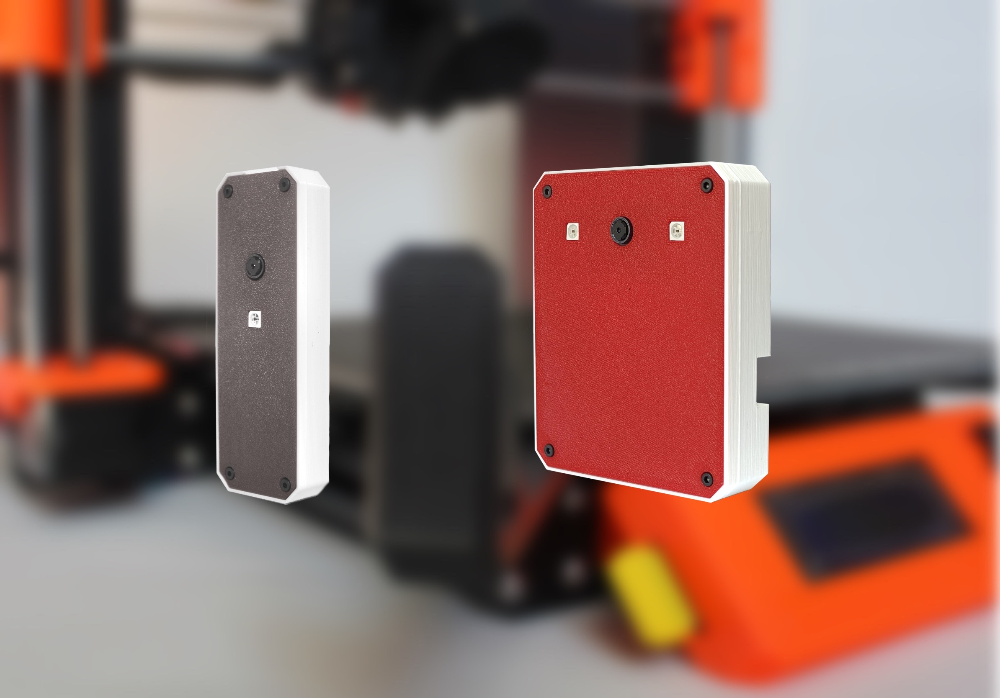

**Tím přehled špatných zpráv končí** a rádi bychom se s Vámi podělili o **pozitivní novinky** ve vývoji Karmen za poslední měsíc.

Ano, je to tak, sehnat po celém světě Raspberry Zero nejde. **Karmen Pill** proto aktuálně nabízíme za stejnou cenu **na výkonnější platformě Raspberry 3A+**.

V minulých newsletterech jsme Vás informovali o **nové verzi aplikace Karmen Cloud**. Po měsících, kdy běžela stará i nová verze paralelně, jsme tu starou vypnuli a Karmen Cloud už běží pouze na ”[nextu](https://next.karmen.tech/)”...

## Co jsme vylepšili a Vy to hned poznáte?

**Videa z průběhu tisku.** Šetříme datový tok, proto se obraz z videa obnovuje rychleji jen u tiskárny, na kterou najedete myší. Pokud máte tedy spuštěných více tisků zároveň, nemělo by docházet k přetížení datového spojení.

Po spuštění tisku Vás Karmen automaticky přesměruje na detail tiskárny a ušetříte si zbytečné klikání.

Nová verze Pillu i Cloudu už nepadá na chybách. Opravili jsme snad už úplně všechny problémy a hraniční situace a tak máme na hotline volno.

## A co máme v backlogu?

- Live streamy obrazu a základní informace o tisku (doba tisku, název tiskového souboru) z Karmen budete moci jednoduše přidat na vaše internetové stránky a TV.

- Nejen školy volají po přidání uživatelských účtů s nižšími oprávněními. Slyšíme to a zařazujeme do plánu vývoje.

- Karmen plugin do Octoprintu - jednoduchá cesta, jak si připojit své řešení nad Octoprintem do našeho Cloudu.

**Martin Burián**

