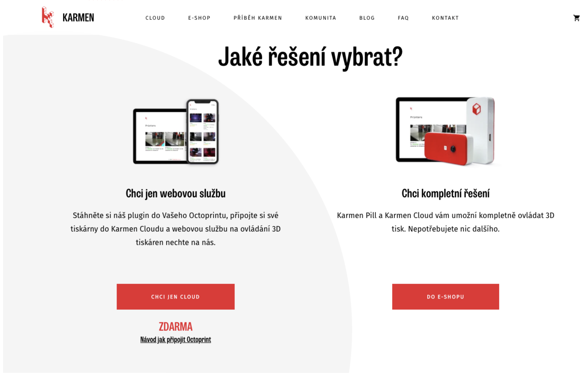
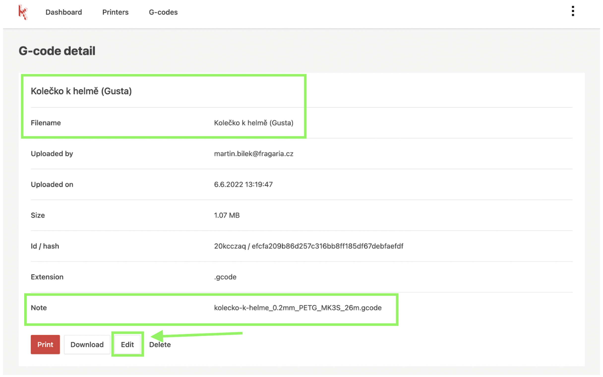

Naposledy jsme se chlubili, že Karmen 3D je bez chyb. Věnujeme se tedy uživatelské přehlednosti a vymazlujeme jednotlivé funkce.

## Na webu jsme lépe rozdělili, co je Karmen 3D

**Karmen je [cloudová služba](https://karmen.tech/cs/produkty/karmen-cloud/), přes kterou ovládáte své 3D tiskárny odkudkoli.** Pokud máte zajištěné bezpečné připojení do internetu (např. přes Octoprint), stačí si [vytvořit účet](https://next.karmen.tech/registration) a [přidat své tiskárny](https://docs.karmen.tech/#/pripojeni-octoprintu-do-karmen-cloudu). Je to zdarma!

3D tiskárnu připojenou nemáte a chcete? **Máme pro Vás [Karmen Pill](https://eshop.karmen.tech/product/e68c5364-e7b9-4c68-864d-5a61bd4d6a85). Hotové řešení, které jednoduše a bezpečně umožní připojení Vaší tiskárny a její správu odkudkoli.** Máme [nový eshop](https://eshop.karmen.tech/), kde brzy najdete i další vychytávky pro 3D tisk.

## A jaké novinky najdete v Karmen?

- Vylepšili jsme rozhraní na ovládání tiskárny (posun tiskové hlavy, změna teploty apod.).

- Zejména pro uživatele s řešením Octoprint jsme přidali možnost editace Device Key a Octoprint Api Key. To se hodí, pokud jste např. upravovali zabezpečení Octoprintu nebo měnili zařízení, kterým připojujete tiskárnu do internetu.

- K tiskovým souborům (g-codům) můžete nově přidávat poznámku, případně měnit název, viz. obrázek.

Na závěr bychom Vás chtěli poprosit. Pokud jste s Karmen spokojeni, dejte to vědět ostatním na sociálních sítích a ve skupinách okolo 3D tisku. Budeme moc rádi za [recenzi](https://www.facebook.com/karmen3D/reviews/) nebo označení @karmen3D u vašich výtisků či progresu projektu na vašich sociálních sítích. Rádi vaši práci přesdílíme dál.

Děkujeme mockrát a přejeme Vám krásné léto. Martin Burián
