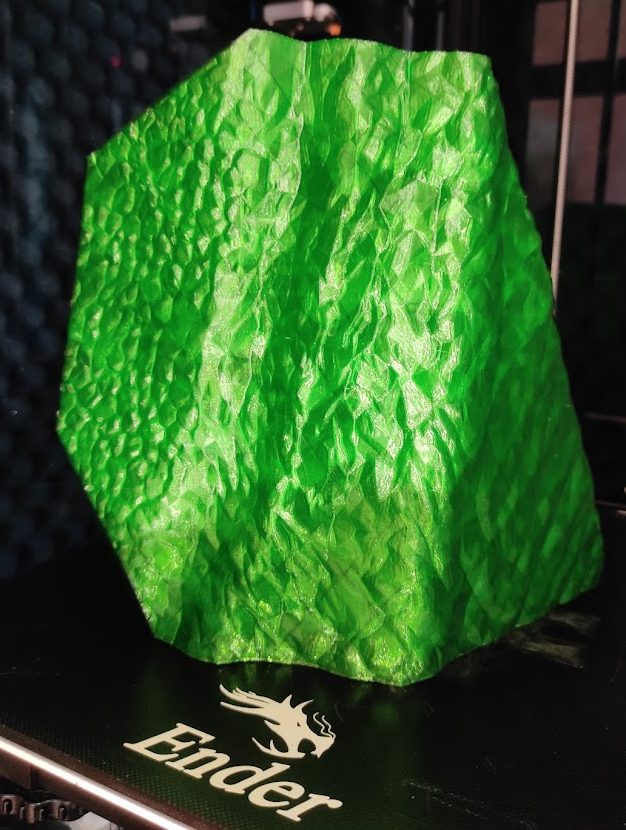
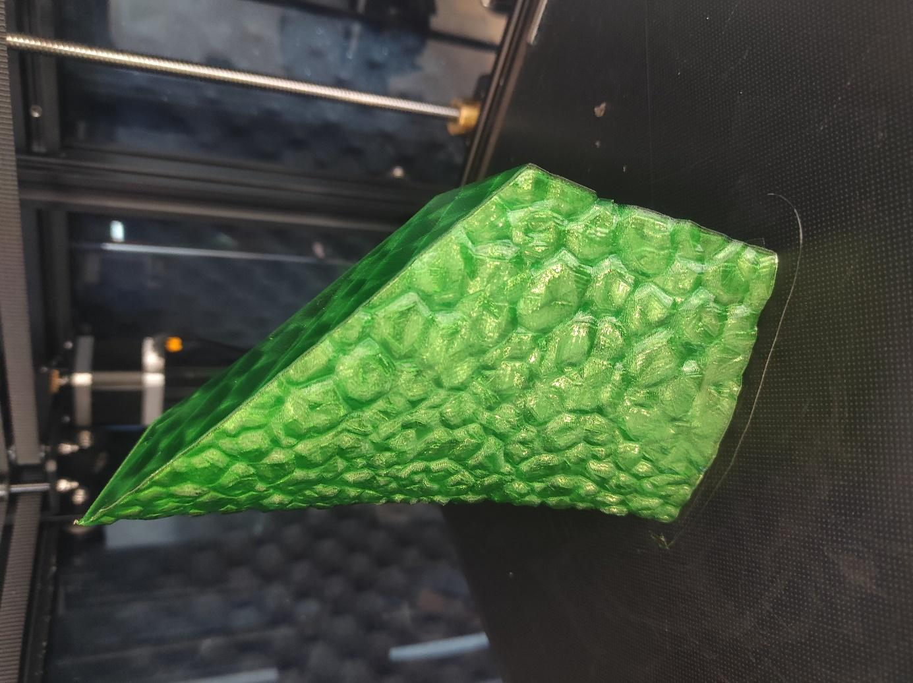

Nejen pro milovníky dinosaurů vznikl projekt PLA(S)TEOSAURUS, který má za cíl edukovat lidi o změnách klimatu a jeho dopadu na nás všechny. Jedná se o projekt kooperativního tisku obrovského Plateosaura, kterého se může zúčastnit jakýkoliv majitel 3D tiskárny.

Na stránce [https://petmat.cz/plasteosaurus](https://petmat.cz/plasteosaurus) si stačí vybrat díl Plateosaura. Následně vám do mailu přijde jeho 3D model. Po domluvě s neziskovou organizací PETMAT z. ú, která má celý projekt na starosti, vám zašlou recyklovaný filament, ze kterého vámi vybraný díl vytisknete. Vytištěný díl jim označíte a pošlete zpět. Dílů si můžete vybrat i více, ale co jsem tak postřehl, jsou vždy po zveřejnění rychle pryč. Na stránkách lze dokonce vidět, kdo už kolik dílů vytiskl.

Poskládaný Plateosaurus bude následně 13. října 2022 odhalen v Národním muzeu v rámci mezinárodního Global Goals Summitu, který se zabývá udržitelností. Samotný Plateosaurus bude v muzeu vystaven jako dočasná expozice, takže ho při návštěvě Národního muzea bude možné vidět vcelku.

Já osobně jsem na projekt narazil náhodou na Facebooku 3D tiskařů. Obratem jsem se zeragistroval, vybral si jeden z větších dílů, z důvodu velké tiskové plochy mé tiskárny Ender 6. Jelikož jsem z Prahy, domluvil jsem se s organizátory, že si materiál na tisk vyzvednu osobně v Praze.  Materiál k tisku je recyklované PETG od firmy EKO MB. Já osobně neměl s rPET-G žádné zkušenosti a tak to byla trošku výzva. Doporučené parametry tisku jsou teplota trysky 225-245 °C a teplota podložky 70-90 °C. V první chvíli jsem si říkal, že kompletně zakrytovaná Ender 6 bude skvělá při tisku vysokých teplot, ale první výsledky tisků mě o tom nepřesvědčily. Nejlepší výsledky jsem měl při otevřeném horním krytu. Přesto, že nemám ve zvyku na klasické PET-G moc foukat, u tohoto materiálu se mi osvědčilo mít ofuk zapnutý. Potom jsem se velmi rychle dostal na tisk rychlostí 90/60 mm/s. Podložku stačilo nahřát na 75 °C, ale trysku vzhledem k rychlosti, extruzi 0,5 mm a výšce vrstvy 0,25 mm jsem musel mít na 245 °C. Odhad doby tisku slicerem Cura byl okolo 10 hodin, což mi k velikosti modelu (117x214x201 mm) přišlo OK. Tiskárna s firmwarem Klipper dokázala reálný čas tisku stáhnout téměř o hodinu, což je moc pěkný výsledek.

*Obrázek 1 – První díl - část těla*

S výsledkem tisku jsem spokojený kromě švu, který není nic extra. Umístil jsem ho ale šikovně dovnitř dinosaura, takže ho zvenku nikdo neuvidí. Celkově jsem na tisk a testy spotřeboval něco mezi 300-350 g materiálu, takže mám v plánu vytisknout ještě nějaký další díl.

V pondělí 4.7.2022 se mi podařilo ukořistit další část dinosaura. Tentokrát byly zveřejněny jednotlivé části krku Plateosaura. Samotné modely, mezi kterými jsem si vybíral, byly výrazně menší než předešlý model. Tiskový profil už jsem měl připravený a samotný tisk krku reálně netrval ani 3 hodiny. Výsledek můžete vidět na druhém obrázku.

*Obrázek 2 – Druhý díl – část krku*

Jelikož je o projekt obrovský zájem, všechny zveřejněné díly jsou velmi rychle rozebrané. Poslední a zatím nezveřejněná část Plateosaura je hlava. Jelikož si myslím, že je hlava nejzajímavější, po jejím zveřejnění budou díly jistě velmi rychle rezervované. V nedávném třetím newsletteru také organizátoři zmínili velký zájem o nově zveřejněné díly a naznačili, že by mohli do budoucna vymyslet další zajímavý projekt pro nás tiskaře.

