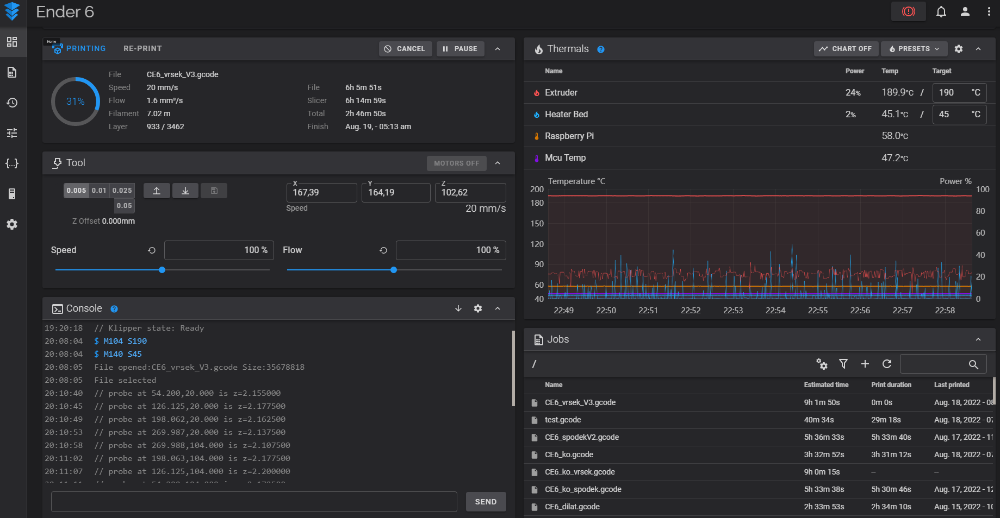
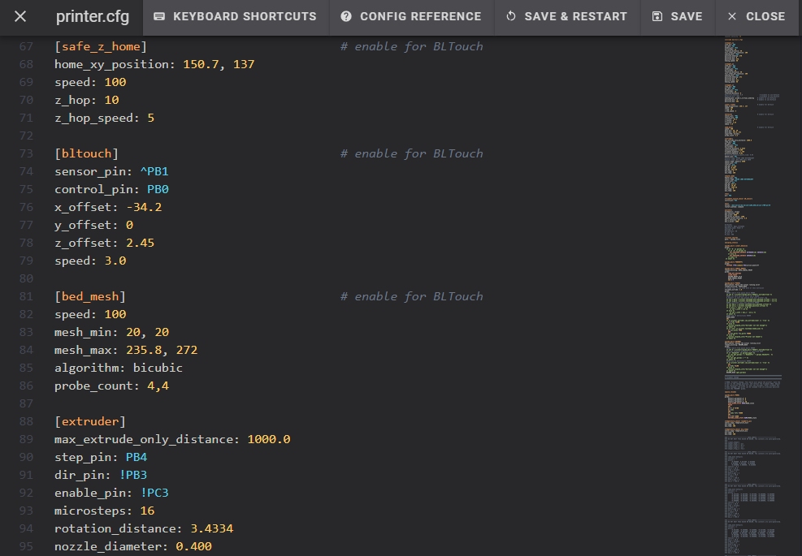
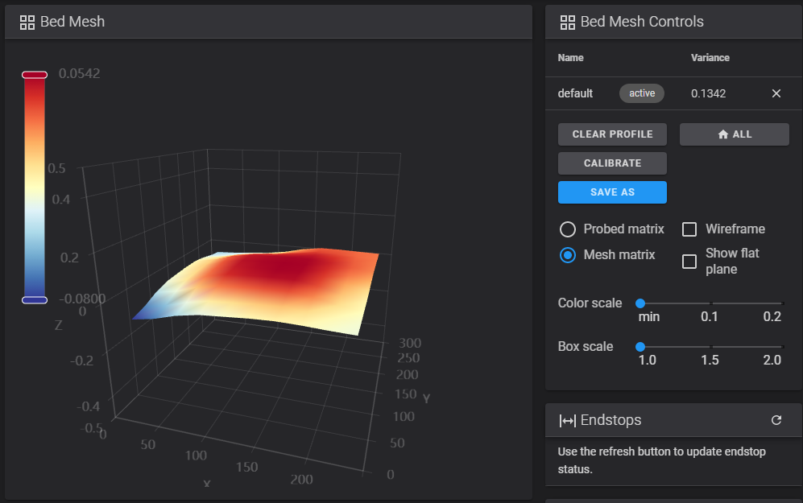

Většina z vás už asi někdy slyšela slovo Klipper, ale věřím, že ne všichni přesně ví, co to je nebo jak to dokonce funguje. Klipper je tak trošku jiný a lepší firmware pro vaši 3D tiskárnu. Zajímavostí je to, že se instaluje na jiné zařízení, než je samotná tiskárna. Tím zařízením bývá nejčastěji mikropočítač Raspberry Pi. Výpočetní zátěž se tedy přesouvá na zpravidla výkonnější Raspberry Pi a tím pádem jsou na základní desku tiskárny kladeny výrazně menší nároky, jelikož základní deska tiskárny jen zpracovává příkazy počítané v Raspberry. Díky tomu můžete i z horších tiskáren s 8bitovými základními deskami vykouzlit lepší stroj. Toto řešení ale dává smysl i u výkonných tiskáren. Navíc Klipper ze své podstaty nabízí velmi přívětivé vzdálené ovládání z PC nebo mobilu, což většina tiskáren v základu neumí.

Já osobně jsem se pro Klipper rozhodl po tom, co jsem nebyl spokojený s dostupnými firmwary Marlin na mou tiskárnu Creality Ender 6. Díky tisku přes Karmen Pill byla tiskárna v některých ohledech použitelnější, ale v mém oblíbeném Vase modu zaostávala i za svým předchůdcem Ender 3. U originálního firmwaru Marlin mi také velmi nevyhovovala složitost jakýchkoliv úprav ve FW, v čemž Klipper naprosto vyniká. V době mého přechodu na Klipper byly Raspberry Pi ještě běžně dostupné, takže byl přechod jednodušší, než teď v polovině roku 2022. Já jsem zvolil model Raspberry Pi Zero 2 W a zpětně musím uznat, že to byla dobrá volba. Pořízení Klipperu mě vyšlo na přibližně 600 Kč i s kabeláží, což je velmi nízká cena za to, jak velký posun to byl pro tiskárnu.

Jelikož je tiskárna Ender 6 trošku specifická, řídil jsem se při instalaci komunitou doporučeným návodem ze stránky [https://3dprintbeginner.com/how-to-install-klipper-on-creality-ender-6/](https://3dprintbeginner.com/how-to-install-klipper-on-creality-ender-6/). Ti připravili podrobný návod s instalací nejen na Ender 6, ale i na jiné specifické stroje a základní desky, takže rozhodně doporučuji. Instalace Klipperu začíná výběrem prostředí, ve kterém ho budete chtít ovládat. Já jsem zvolil prostředí Fluidd. S jeho konkurenčním Mainsail OS mají mnoho společného a velké rozdíly v nich nevidím. Samotná instalace Fluidd probíhá na počítači, kam se samotný systém nahraje na Micro SD kartu. Na kartě se následně nakonfiguruje připojení k vaší Wi-Fi síti a kartu dáte do Raspberry Pi. Raspberry Pi zapojíte k tiskárně, připojí se na Wi-Fi a nadále už ho můžete kompletně ovládat vzdáleně ze zařízení připojeného do vaší sítě. Následuje kompletní konfigurace firmwaru tak, aby byl kompatibilní s vaší tiskárnou. Po vytvoření FW ho nahrajete do tiskárny a je skoro hotovo.

*Obrázek 1 – Prostředí Fluidd*

Na obrázku 1 je vidět prostředí Fluidd zobrazené na PC v prohlížeči. V levé horní části je vidět aktuální stav tisku. Najdeme tu procento dokončení, aktuální rychlost, průtok tryskou, spotřebovaný filament. Dále jsou tu odhadovaný čas dokončení, aktuální doba tisku atd. Pod ním je ruční ovládací panel a následuje konzole pro zadávání příkazů. V pravé části je oblast pro kontrolu, ale i ruční zadávání teplot, včetně grafů. Během samotného tisku tedy vidíte v ovládacím prostředí všechny potřebné údaje o tiskárně, jako jsou požadované teploty, měřené teploty, aktuální výkon jednotlivých topných těles apod. Dále je zde přehledně vidět přehled gcodů, které máte na Raspberry nahrané. U nich jsou pak vidět odhadované doby tisku, u těch, co už byly jednou tisknuty, je vidět reálný čas tisku. Tyto soubory se sem dají jednoduše přetáhnout ze složky z PC nebo je zde i možnost posílat soubory přímo ze sliceru Cura.

Pokud máte vytvořený firmware, je nutné ještě v ovládacím prostředí nastavit Configurační soubor printer.cfg. V tomto Configu najdete přehledně všechny parametry vaší tiskárny a můžete je libovolně měnit. Nasazení nových parametrů se provede pouhým uložením a restartu FW. Jinak řečeno po změně jakéhokoliv parametru kliknete na „Save and restart“ a můžete do 5 sekund začít tisknout s novými parametry. Nemusíte tedy kvůli každé změně kompilovat celý FW a znovu ho nahrávat do tiskárny. Tento konfigurační soubor se dá vyexportovat jako textový dokument, a tedy snadno zálohovat.

*Obrázek 2 – Část konfiguračního souboru*

Pokud máte BLtouch nebo podobné zařízení, Klipper vám mimo jiné nabízí možnost udělat si Mesh bedu. Jinak řečeno otestovat křivost podložky v požadovaném počtu bodů. Já provádím takovýto test před každým tiskem pomocí makra, které spouštím příkazem ve Start Gcode. Výsledkem je grafika křivosti podložky, viz obrázek 3, podle které se dá případně bed seřídit. Klipper samozřejmě bere při tisku v potaz křivost podložky a snaží se jej kompenzovat.

*Obrázek 3 – Křivost podložky (Mesh 4x4 body)*

Po kompletním nastavení tiskárny se můžete vrhnout na samotný tisk. Já osobně jsem nemusel ve sliceru dělat žádné změny v nastavení. Jediné, co bych doporučoval, je vypnout kontrolu všeho, co můžete přenechat na Klipper. Mluvím například o řízení zrychlení. I přes to, že jsem měl ve sliceru Cura nastaveno zrychlení stejné jako v Klipperu, tzn. 3000 mm2/s, po vypnutí tohoto řízení ve sliceru je Klipper schopen zkrátit dobu tisku na mé tiskárně až o desítky procent (cca 10-40 %). Další věc je kvalita tisku. Ta se při zachování tiskových profilů ve sliceru v základním nastavením Klipperu zvýšila.

Pokud by vám rychlost a kvalita tisku přesto nedostačovala, Klipper nabízí mnoho funkcí, které vám pomohou. Těmi se budeme prakticky zabývat v druhé části článku o firmwaru Klipper. V něm si ukážeme různé funkce, které dokáží i díky výpočetnímu výkonu Raspberry Pi predikovat určité mechanické a fyzikální neduhy tiskárny a kompenzovat je.

__Lukáš Žídek__

