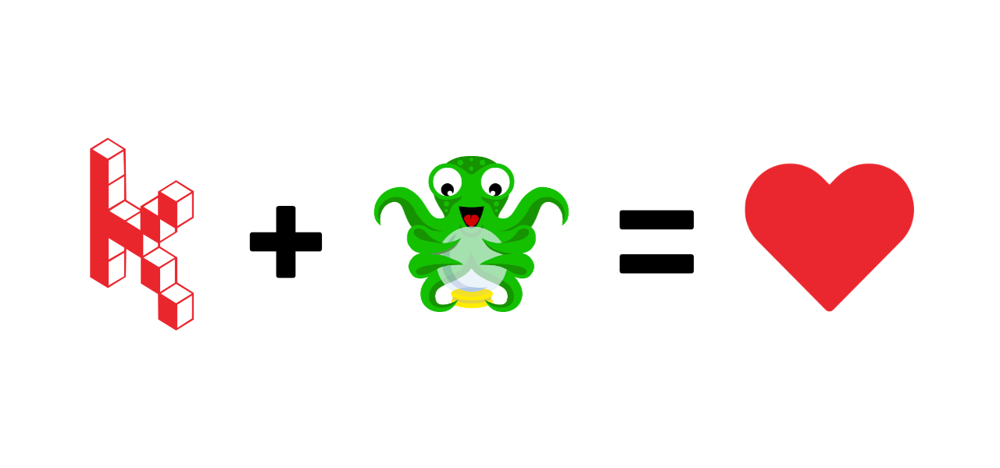

Od minule se toho u nás stalo a děje hodně. Budeme rádi, pokud si přečtete, co je nového v [Karmen - řešení pro vzdálenou správu 3D tiskáren](https://karmen.tech/).

[Karmen Connector](https://plugins.octoprint.org/plugins/karmen/) je oficiálně ke stažení v [repozitáři OctoPrint pluginů](https://plugins.octoprint.org/). Všichni uživatelé OctoPrintu mají tedy možnost připojit své řešení do [Karmen Cloudu](https://karmen.tech/cs/produkty/karmen-cloud) a zdarma využívat všech funkčností, které Karmen přináší. Zapracovali jsme na [dokumentaci](https://docs.karmen.tech/#/karmen-octo-plugin) a věříme, že připojení bude jednoduché. Pokud Vám cokoliv nepůjde, rádi pomůžeme.

**Budeme rádi, pokud se za námi zastavíte na Maker faire v Praze (17. - 18.9., hala 13) a v Brně (22. - 23.10.).** Karmen má mimojiné za cíl snížit množství pokažených tisků a zbytečně vyhozeného filamentu. Zmetky budeme na stánku sbírat, tak nám je prosím přineste a my Vás za to odměníme. Vedle toho Vám rádi ukážeme celé naše řešení a jeho přínosy.

*Maker Faire Česká republika*

V Karmen máte nově možnost tvořit **veřejné profily pracovních skupin a veřejný obsah**. Věříme, že komunita ocení možnosti sdílení videí z tisku a do budoucna i dalšího obsahu (fotografie, gcodes, stl apod.).

**Chystáme integraci Karmen s firmware Klipper**. Jako ochutnávku máme pro Vás [blog od Lukáše Žídka](https://karmen.tech/cs/blog/2022-08-26-klipper/), který vyzkoušel instalaci Klipperu v kombinaci s tiskárnou Creality Ender 6. Výsledkem je kvalitnější a rychlejší tisk.

Ve vývoji je toho více, ale to už byste neučetli, tak zase za měsíc!

Děkujeme za přízeň a přejeme pěkný konec léta!

__Martin Burián__

