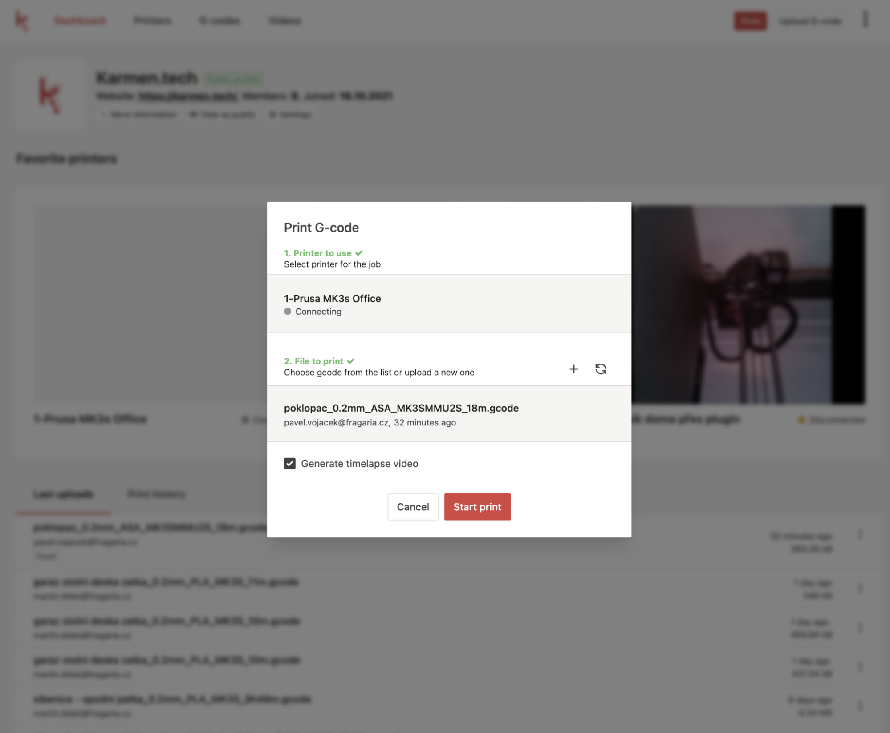

Od posledně se toho událo mnoho, tak pojďme na to:

## 1. Plugin do Octoprintu
Denně nám přibývá kolem 5-8 nových uživatelů, kteří si nainstalovali [Karmen plugin do svého Octoprintu](https://plugins.octoprint.org/plugins/karmen/) a mohou tak nově ovládat a monitorovat své 3D tiskárny bezpečně odkudkoliv.
Pokud máte Octoprint, vyzkoušejte a dejte nám prosím vědět, jak se Vám líbí.

## 2. Karmen Pill
Opravili jsme několik hraničních případů, kdy se Pill za specifických okolností odpojoval od Karmen Cloudu a nyní už opravdu nevíme o ničem, kdy by něco nefungovalo. Pokud na něco narazíte, dejte nám prosím vědět - budeme se tomu s velkou prioritou věnovat.

## 3. Maker Faire
Jsme hrdým partnerem [Maker Faire ČR](https://makerfaire.cz/) a minulý víkend jsme vystavovali v Praze. Bylo to parádní a jsme moc rádi za feedback a podporu. Pokud se chystáte předposlední víkend do Brna, vezměte z domova své zmetky, společně s nimi skoncujeme.
[https://drive.google.com/drive/folders/1Bont-5t9HYUdgl-nnSd3S-sw4svlGyBJ](https://drive.google.com/drive/folders/1Bont-5t9HYUdgl-nnSd3S-sw4svlGyBJ)

## 4. Novinky z vývoje
Dále rozšiřujeme funkcionalitu Karmen a přidáváme i další vychytávky. Sdílení tiskáren, videí, g-codů apod. je naší velkou prioritou. Veřejný profil již funguje, podívejte se na ten [náš](https://next.karmen.tech/public/groups/inqp39rw). Veřejný profil si můžete vytvořit a nastavit v Karmen Cloudu v nastavení pracovní skupiny.
Máme nový print dialog. Na dvě kliknutí tak můžete spustit tisk víceméně odkudkoliv - například “vpravo nahoře” je tiskové tlačítko dostupné po celou dobu přihlášení.

*Karmen - nový print dialog*

## 5. Na co se můžete těšit?
Jsme přibližně v polovině proof of conceptu integrace s firmware Klipper, tak nám držte palce. Pokud Klipper používáte ve spojení s Octoprintem, tak ho můžete začít používat již nyní - doinstalujte si do Octoprintu Karmen plugin a tiskněte přes Klipper.

## 6. Feedback a sociální sítě
Prosíme Vás, zda byste nám dali vědět, jak jste s řešením Karmen spokojeni, co Vám chybí, co je třeba zlepšit a co Vás naopak baví. Budeme rádi i za sdílení a komentování našich příspěvků na sociálních sítí, případně nás prosím neváhejte označovat, rádi Vaše příspěvky přesdílíme.

Hezké babí léto a třeba se koncem října uvidíme v Brně na Maker Faire.

__Martin__
 Karmen team

