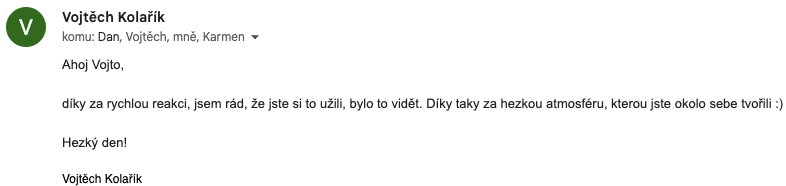
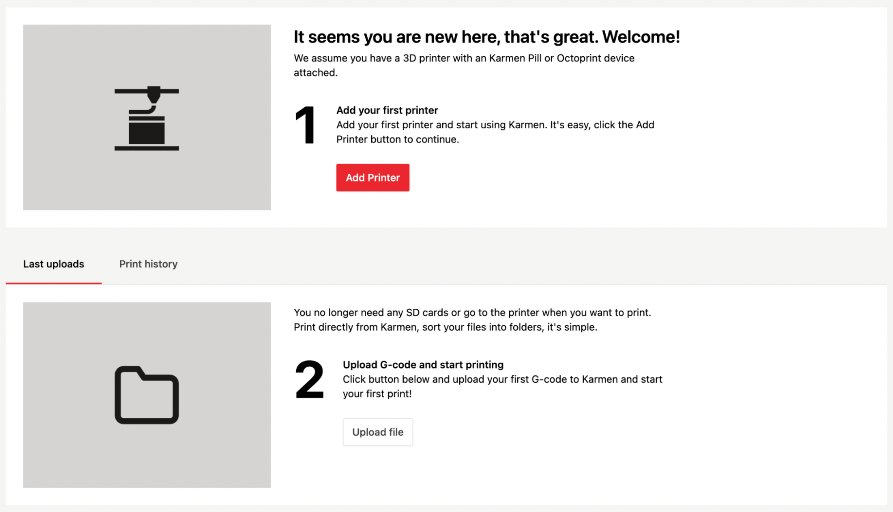
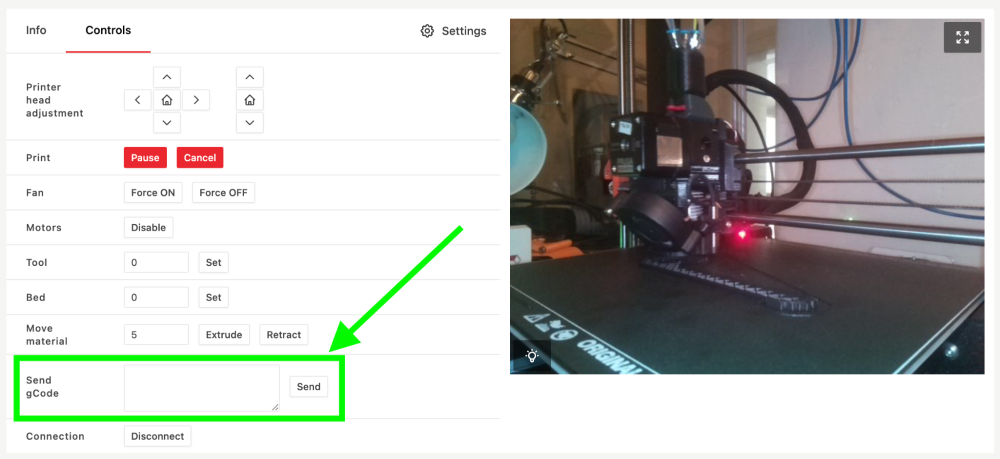

<div class="typeset">

  Vážení,

rádi bychom Vás informovali o novinkách v **Karmen -  řešení na vzdálenou správu 3D tiskáren**. Tak jak roste počet uživatelů, roste naše nadšení pro další rozvoj.

## Automatická detekce chyb a notifikace uživatele
Ve stádiu výzkumu a vývoje je **automatické rozpoznání chyby při tisku**. Věříme, že již brzy budou uživatelé v Karmen upozorněni, pokud se bude zdát, že se tisk kazí.

## Rozdáváme radost
Moc jsme si letos užili Maker faire v Praze a Brně. Spokojenost uživatelů nám dává hodně **energie, kterou se snažíme vracet jak ve vývoji nových funkcí v aplikaci, tak i směrem do komunity**. A máme radost, že si toho někdo všiml, posuďte sami:



## Další novinky z vývoje
**Možnost odeslání vlastního GCode příkazu přímo na tiskárnu.** V panelu pro ovládání tiskárny je nově možnost odeslat vlastní GCode příkaz. Pokud nevíte, k čemu byste tuhle funkci využili, vůbec to nevadí, slouží primárně pro pokročilé uživatele. Ale pokud by Vám to přecejen nedalo, zkuste odeslat následující příkaz, který by měl přehrát zvuk: 

  ```
  M300 S2000 P1000
  ````
  
A pokud byste si chtěli pustit celou písničku, koukněte třeba [sem](https://github.com/alexyu132/midi-m300/tree/master/samples).🙂




Dále pracujeme na **veřejném profilu**, abyste mohli při dodržení všech bezpečnostních zásad sdílet videa a nově také informace, co která tiskárna tiskne a live stream z kamery. 

**Vylepšili** jsme zobrazení videí a ovládacích prvků **na mobilních zařízeních**.

Noví uživatelé v [next.karmen.tech](https://next.karmen.tech) dostávají přehledný návod jak jednoduše přidat svou 3D tiskárnu a uploadovat první tiskové soubory.



## Feedback a sociální sítě
Znovu bychom Vás chtěli požádat, zda byste nám dali vědět, jak jste s řešením Karmen spokojeni, co Vám chybí, co je třeba zlepšit a co Vás naopak baví. Kvalitní zpětná vazba nám moc pomáhá. Budeme také rádi za sdílení a komentování našich příspěvků na sociálních sítí, případně nás prosím neváhejte označovat, rádi Vaše příspěvky přesdílíme.

Přejeme Vám hezký advent a budeme tady pro Vás i v novém roce.

__Martin__
<br />Karmen team

</div>
