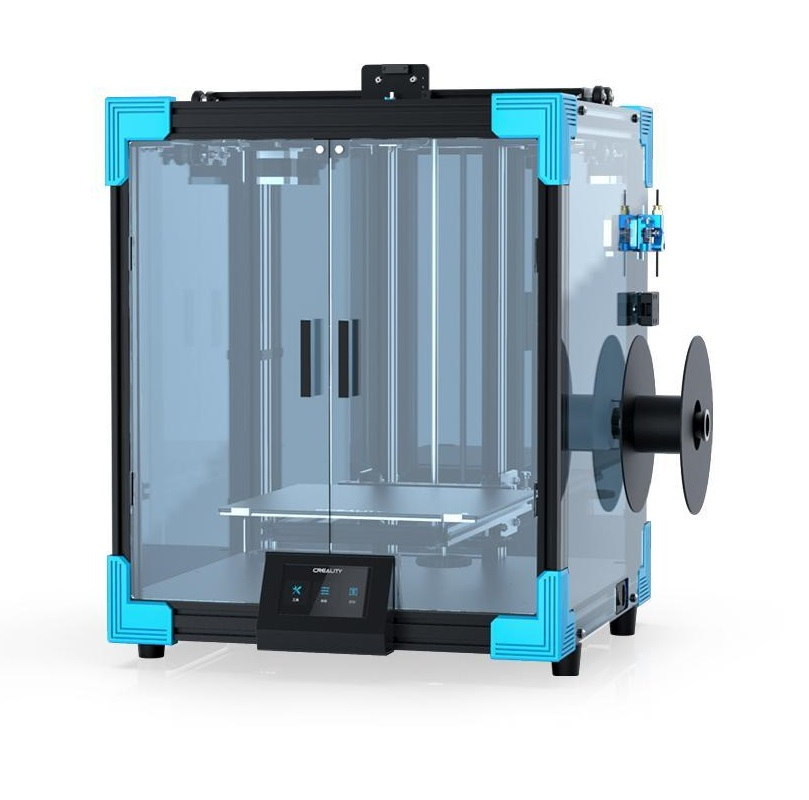

Pro rok 2021 si čínská firma Creality připravila několik novinek v oblasti 3D tisku. Jednou z nich je  inovativní tiskárna Ender 6. Tiskárna nabízí tiskovou plochu 250x250 mm (reálně až 260x260 mm) a výšku tisku 400 mm. Samotná tiskárna má pak rozměr 495x495x650 mm a váží úctyhodných 25 kg.

Creality Ender 6 (zdroj https://www.crealitystore.cz/p/creality-ender-6)

Ender 6 je ale zajímavý především svou rychlostí tisku. Creality udává rychlost až 150 mm/s při zachování přesnosti ±0,1 mm. Většina výrobců tiskáren, včetně Creality, udává rychlost jako maximální možnou, ta však nebývá reálně použitelná. U Ender 6 je ale rychlost 150 mm/s reálná se zachováním rozumné kvality tisku. Vyšších rychlostí je dosaženo mechanismem pohybu Core XY. Tato technologie se již objevila na tiskárnách od jiných výrobců, u Creality je to ale úplná novinka. Pohyb je tvořen řemínky, které jsou napnuty pomocí soustavy kladek, jako je vidět na obrázku. Pohyb čistě v ose X anebo Y tedy není tvořen jedním motorem, jako je tomu u klasických tiskáren, ale oběma motory (X a Y). Otáčení obou motorů ve stejném směru má za následek horizontální pohyb. Otáčení obou motorů v opačných směrech má za následek vertikální pohyb. Oba motory jsou pevně připevněny na rámu tiskárny, nikoliv na tiskové hlavě, což výrazně zmenšuje setrvačnosti a tím zvyšuje právě kvalitu tisku i při vyšších rychlostech.

Systém pohybu Core XY (zdroj: http://corexy.com)

Již na první pohled je vidět, že Ender 6 je částečně zakrytovaný, což přináší nejrůznější výhody. Může se zdát, že díky krytu je možné lépe tisknout větší objekty z materiálů s velkou smrštivostí, jako je typicky ABS. Bohužel to není úplně pravda, protože zakryté jsou pouze bočnice, nikoliv však vršek tiskárny. Z toho vyplývá, že většina tepla uteče vrchem tiskárny. Určitě se v tiskárně drží více tepla než v úplně odkryté. Možná se tedy ptáte, k čemu jsou bočnice dobré. Prakticky slouží dobře jako ochrana proti průvanu. Typicky pokud chodíte kolem tiskárny, otevíráte dveře, může to mít negativní vliv na výslednou kvalitu tisku. Další výhodou zakrytování je mírné odhlučnění tiskárny. Nezdá se to, ale i částečné zakrytí proti hluku pomáhá. Přeci jen se hluk tolik nerozléhá do celého okolí, ale je jasné, že vrchem většina hluku odchází. Největší hluk na celé tiskárně způsobuje ofuk hotendu, který je stejně na vrchu tiskárny.

## Moje krátké hodnocení:

Tiskárnu mám necelý týden, takže nemám vše vyzkoušené, ale nějaký názor už jsem stihl udělat. 

Celkově tiskárna splnila moje očekávání. Její složení je velmi jednoduché a rychlé, návod je přehledný. Po složení tiskárny není potřeba nic moc seřizovat, hlavní komponenty jsou už složené, spustil jsem tisk a ten proběhl v pořádku. 

Co se zakrytování týče, tak se určitě nabízí dodělat vrchní kryt na tiskárnu. Tím by se vyřešila i celkem velká hlučnost ofuku hotendu.  Plné zakrytování mám určitě v plánu, takže se můžete těšit, že vám řešení ukážu v nějakém z dalších článků. 

Lukáš Žídek
